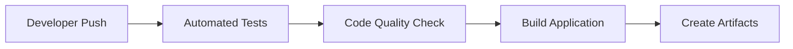
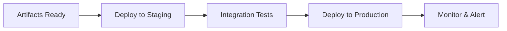
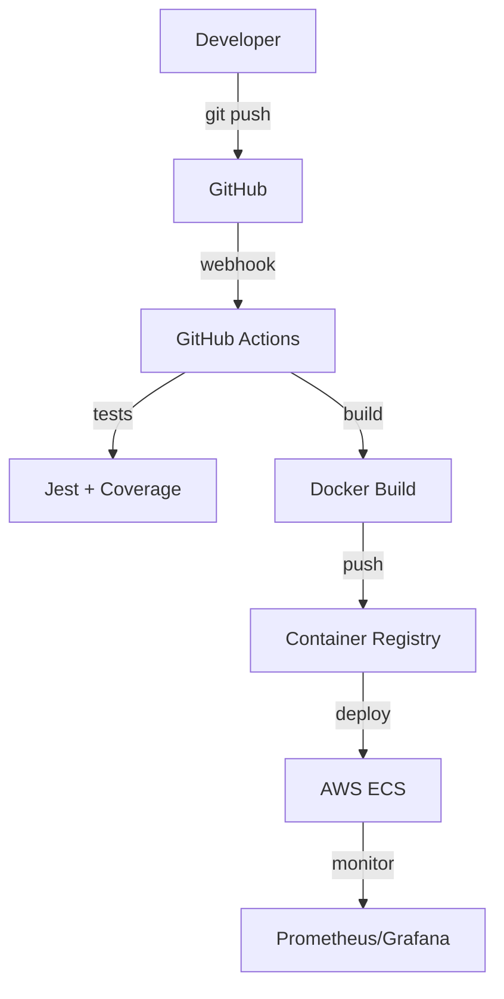

# CI/CD para Estudiantes: De Cero a Héroe en 30 Días

*Publicado el 22 de junio, 2025 • Por Code+ Team • Categoría: DevOps Education*


Después de enseñar DevOps en universidades por más de 8 años, he visto el mismo patrón una y otra vez: **estudiantes brillantes que saben programar, pero no saben cómo llevar su código a producción de manera profesional**.

Este artículo es tu roadmap completo para dominar CI/CD, desde conceptos básicos hasta implementación real. **¡Todo con ejemplos prácticos que puedes hacer desde tu laptop!**

## 🎯 ¿Por qué CI/CD es TU diferenciador en el mercado laboral?

### La Realidad del Mercado (2025)

**Antes (2020):**
- "Saber programar" era suficiente
- Deploy manual era aceptable
- Git básico era un plus

**Ahora (2025):**
- **CI/CD es requisito básico** en 89% de ofertas DevOps
- **Infrastructure as Code** en 76% de posiciones
- **Container orchestration** en 68% de roles senior

> **Dato real**: En Code+, revisamos +200 CVs al mes. Solo 12% de recién egresados menciona experiencia en CI/CD.

## 🛠️ Proyecto Práctico: "TaskManager Pro"

Vamos a crear una app completa con CI/CD profesional. **No es un tutorial más de "Hello World"**.

### Stack Tecnológico
```bash
Frontend: React + TypeScript
Backend: Node.js + Express + PostgreSQL
Containerización: Docker + Docker Compose
CI/CD: GitHub Actions
Deploy: AWS ECS + RDS
Monitoreo: Prometheus + Grafana
```

## Día 1-5: Fundamentos (The Why)

### ¿Qué es CI/CD Realmente?

**Continuous Integration (CI):**


**Continuous Deployment (CD):**


### El Anti-Pattern que Debes Evitar

```bash
# ❌ Lo que NO hacer (pero todos hacemos al principio)
git add .
git commit -m "funciona en mi máquina"
git push origin main
# Luego manualmente:
# - SSH al servidor
# - git pull
# - npm install
# - npm run build
# - pm2 restart app
# - Rezar que funcione 🙏
```

```yaml
# ✅ Lo que SÍ hacer (profesional)
name: CI/CD Pipeline
on:
  push:
    branches: [main, develop]
  pull_request:
    branches: [main]

jobs:
  test:
    runs-on: ubuntu-latest
    steps:
      - uses: actions/checkout@v3
      - name: Run Tests
        run: |
          npm ci
          npm run test:coverage
          npm run lint
          npm run security-audit
```

## Día 6-15: Implementación Hands-On

### Paso 1: Setup del Proyecto Base

```bash
# Crea la estructura profesional
mkdir taskmanager-pro && cd taskmanager-pro
mkdir {frontend,backend,infrastructure,scripts}

# Backend API
cd backend
npm init -y
npm install express helmet cors compression dotenv
npm install -D jest supertest eslint prettier nodemon
```

**backend/package.json** (configuración profesional):
```json
{
  "scripts": {
    "start": "node src/server.js",
    "dev": "nodemon src/server.js",
    "test": "jest --coverage",
    "test:watch": "jest --watch",
    "lint": "eslint src/",
    "lint:fix": "eslint src/ --fix",
    "security-audit": "npm audit --audit-level moderate"
  },
  "jest": {
    "testEnvironment": "node",
    "collectCoverageFrom": ["src/**/*.js"],
    "coverageThreshold": {
      "global": {
        "branches": 80,
        "functions": 80,
        "lines": 80,
        "statements": 80
      }
    }
  }
}
```

### Paso 2: Containerización Profesional

```dockerfile
# backend/Dockerfile - Multi-stage build
FROM node:18-alpine AS builder
WORKDIR /app
COPY package*.json ./
RUN npm ci --only=production && npm cache clean --force

FROM node:18-alpine AS runtime
RUN addgroup -g 1001 -S nodejs && adduser -S nodeuser -u 1001
WORKDIR /app
COPY --from=builder /app/node_modules ./node_modules
COPY --chown=nodeuser:nodejs . .
USER nodeuser
EXPOSE 3000
HEALTHCHECK --interval=30s --timeout=3s --start-period=5s --retries=3 \
  CMD curl -f http://localhost:3000/health || exit 1
CMD ["npm", "start"]
```

```yaml
# docker-compose.yml - Entorno completo de desarrollo
version: '3.8'
services:
  backend:
    build: ./backend
    ports:
      - "3000:3000"
    environment:
      - NODE_ENV=development
      - DB_HOST=postgres
      - REDIS_URL=redis://redis:6379
    depends_on:
      postgres:
        condition: service_healthy
      redis:
        condition: service_healthy
    volumes:
      - ./backend:/app
      - /app/node_modules

  postgres:
    image: postgres:15-alpine
    environment:
      POSTGRES_DB: taskmanager
      POSTGRES_USER: dev
      POSTGRES_PASSWORD: devpass123
    volumes:
      - postgres_data:/var/lib/postgresql/data
    healthcheck:
      test: ["CMD-SHELL", "pg_isready -U dev"]
      interval: 10s
      timeout: 5s
      retries: 5

  redis:
    image: redis:7-alpine
    healthcheck:
      test: ["CMD", "redis-cli", "ping"]
      interval: 10s
      timeout: 3s
      retries: 5

volumes:
  postgres_data:
```

### Paso 3: Pipeline CI/CD Real

```yaml
# .github/workflows/ci-cd.yml
name: 🚀 CI/CD Pipeline

on:
  push:
    branches: [main, develop]
  pull_request:
    branches: [main]

env:
  REGISTRY: ghcr.io
  IMAGE_NAME: ${{ github.repository }}

jobs:
  # Job 1: Testing & Quality Assurance
  test:
    name: 🧪 Test & Quality
    runs-on: ubuntu-latest
    strategy:
      matrix:
        node-version: [16, 18, 20]
    
    steps:
      - name: 📥 Checkout code
        uses: actions/checkout@v4

      - name: 🟢 Setup Node.js ${{ matrix.node-version }}
        uses: actions/setup-node@v4
        with:
          node-version: ${{ matrix.node-version }}
          cache: 'npm'
          cache-dependency-path: backend/package-lock.json

      - name: 📦 Install dependencies
        run: |
          cd backend
          npm ci

      - name: 🔍 Run linting
        run: |
          cd backend
          npm run lint

      - name: 🛡️ Security audit
        run: |
          cd backend
          npm audit --audit-level moderate

      - name: 🧪 Run tests
        run: |
          cd backend
          npm run test

      - name: 📊 Upload coverage to Codecov
        uses: codecov/codecov-action@v3
        with:
          file: ./backend/coverage/lcov.info
          flags: backend
          name: backend-coverage

  # Job 2: Build & Push Container Images
  build:
    name: 🏗️ Build & Push
    runs-on: ubuntu-latest
    needs: test
    if: github.ref == 'refs/heads/main'
    
    steps:
      - name: 📥 Checkout code
        uses: actions/checkout@v4

      - name: 🔐 Log in to Container Registry
        uses: docker/login-action@v3
        with:
          registry: ${{ env.REGISTRY }}
          username: ${{ github.actor }}
          password: ${{ secrets.GITHUB_TOKEN }}

      - name: 🏷️ Extract metadata
        id: meta
        uses: docker/metadata-action@v5
        with:
          images: ${{ env.REGISTRY }}/${{ env.IMAGE_NAME }}
          tags: |
            type=ref,event=branch
            type=sha,prefix={{branch}}-
            type=raw,value=latest,enable={{is_default_branch}}

      - name: 🏗️ Build and push Docker image
        uses: docker/build-push-action@v5
        with:
          context: ./backend
          push: true
          tags: ${{ steps.meta.outputs.tags }}
          labels: ${{ steps.meta.outputs.labels }}
          cache-from: type=gha
          cache-to: type=gha,mode=max

  # Job 3: Deploy to Staging
  deploy-staging:
    name: 🚀 Deploy to Staging
    runs-on: ubuntu-latest
    needs: build
    environment: staging
    
    steps:
      - name: 📥 Checkout code
        uses: actions/checkout@v4

      - name: 🔧 Configure AWS credentials
        uses: aws-actions/configure-aws-credentials@v4
        with:
          aws-access-key-id: ${{ secrets.AWS_ACCESS_KEY_ID }}
          aws-secret-access-key: ${{ secrets.AWS_SECRET_ACCESS_KEY }}
          aws-region: us-east-1

      - name: 🚀 Deploy to ECS
        run: |
          # Update ECS service with new image
          aws ecs update-service \
            --cluster taskmanager-staging \
            --service taskmanager-backend \
            --force-new-deployment

      - name: ⏳ Wait for deployment
        run: |
          aws ecs wait services-stable \
            --cluster taskmanager-staging \
            --services taskmanager-backend

      - name: 🧪 Run smoke tests
        run: |
          ./scripts/smoke-tests.sh staging

  # Job 4: Deploy to Production (con aprobación manual)
  deploy-production:
    name: 🎯 Deploy to Production
    runs-on: ubuntu-latest
    needs: deploy-staging
    environment: production
    if: github.ref == 'refs/heads/main'
    
    steps:
      - name: 🚀 Deploy to Production
        run: |
          echo "🎉 Deploying to production..."
          # Aquí iría el deployment real a producción
```

## Día 16-25: Monitoreo y Observabilidad

### Setup de Monitoreo Profesional

```yaml
# monitoring/docker-compose.monitoring.yml
version: '3.8'
services:
  prometheus:
    image: prom/prometheus:latest
    container_name: prometheus
    ports:
      - "9090:9090"
    volumes:
      - ./prometheus.yml:/etc/prometheus/prometheus.yml
      - prometheus_data:/prometheus
    command:
      - '--config.file=/etc/prometheus/prometheus.yml'
      - '--storage.tsdb.path=/prometheus'
      - '--web.console.libraries=/etc/prometheus/console_libraries'
      - '--web.console.templates=/etc/prometheus/consoles'
      - '--storage.tsdb.retention.time=200h'
      - '--web.enable-lifecycle'

  grafana:
    image: grafana/grafana:latest
    container_name: grafana
    ports:
      - "3001:3000"
    environment:
      - GF_SECURITY_ADMIN_PASSWORD=admin123
    volumes:
      - grafana_data:/var/lib/grafana
      - ./grafana/provisioning:/etc/grafana/provisioning

volumes:
  prometheus_data:
  grafana_data:
```

### Métricas de Aplicación (Node.js)

```javascript
// backend/src/metrics.js
const promClient = require('prom-client');

// Crear métricas personalizadas
const httpRequestDuration = new promClient.Histogram({
  name: 'http_request_duration_seconds',
  help: 'Duration of HTTP requests in seconds',
  labelNames: ['method', 'route', 'status_code'],
  buckets: [0.1, 0.3, 0.5, 0.7, 1, 3, 5, 7, 10]
});

const httpRequestTotal = new promClient.Counter({
  name: 'http_requests_total',
  help: 'Total number of HTTP requests',
  labelNames: ['method', 'route', 'status_code']
});

const activeConnections = new promClient.Gauge({
  name: 'nodejs_active_connections',
  help: 'Number of active connections'
});

// Middleware de métricas
const metricsMiddleware = (req, res, next) => {
  const start = Date.now();
  
  res.on('finish', () => {
    const duration = (Date.now() - start) / 1000;
    const route = req.route ? req.route.path : req.path;
    
    httpRequestDuration
      .labels(req.method, route, res.statusCode)
      .observe(duration);
    
    httpRequestTotal
      .labels(req.method, route, res.statusCode)
      .inc();
  });
  
  next();
};

module.exports = {
  metricsMiddleware,
  register: promClient.register
};
```

## Día 26-30: Optimización y Mejores Prácticas

### Scripts de Automatización

```bash
#!/bin/bash
# scripts/smoke-tests.sh

set -e

ENVIRONMENT=${1:-staging}
BASE_URL="https://api-${ENVIRONMENT}.taskmanager.com"

echo "🧪 Running smoke tests for $ENVIRONMENT..."

# Test 1: Health check
response=$(curl -s -o /dev/null -w "%{http_code}" ${BASE_URL}/health)
if [ $response -eq 200 ]; then
    echo "✅ Health check passed"
else
    echo "❌ Health check failed (HTTP $response)"
    exit 1
fi

# Test 2: API endpoints
endpoints=("/api/tasks" "/api/users" "/api/auth/status")

for endpoint in "${endpoints[@]}"; do
    response=$(curl -s -o /dev/null -w "%{http_code}" ${BASE_URL}${endpoint})
    if [ $response -eq 200 ] || [ $response -eq 401 ]; then
        echo "✅ $endpoint responded correctly"
    else
        echo "❌ $endpoint failed (HTTP $response)"
        exit 1
    fi
done

# Test 3: Database connectivity
response=$(curl -s ${BASE_URL}/api/health/db | jq -r '.status')
if [ "$response" = "healthy" ]; then
    echo "✅ Database connectivity OK"
else
    echo "❌ Database connectivity failed"
    exit 1
fi

echo "🎉 All smoke tests passed for $ENVIRONMENT!"
```

### Performance Testing con k6

```javascript
// tests/performance/load-test.js
import http from 'k6/http';
import { check, sleep } from 'k6';

export let options = {
  stages: [
    { duration: '2m', target: 10 }, // Ramp up
    { duration: '5m', target: 50 }, // Stay at 50 users
    { duration: '2m', target: 0 },  // Ramp down
  ],
  thresholds: {
    http_req_duration: ['p(95)<500'], // 95% de requests < 500ms
    http_req_failed: ['rate<0.01'],    // Error rate < 1%
  },
};

export default function () {
  // Test crear tarea
  let payload = JSON.stringify({
    title: 'Load test task',
    description: 'Created by k6 load test',
    priority: 'medium'
  });

  let params = {
    headers: {
      'Content-Type': 'application/json',
      'Authorization': 'Bearer your-test-token'
    },
  };

  let response = http.post('https://api.taskmanager.com/api/tasks', payload, params);
  
  check(response, {
    'status is 201': (r) => r.status === 201,
    'response time < 500ms': (r) => r.timings.duration < 500,
  });

  sleep(1);
}
```

## 🎓 Proyecto Final: Tu Portfolio CI/CD

### Entregables para tu GitHub

1. **README.md épico** con badges de build status
2. **Pipeline CI/CD funcional** con deploy real
3. **Monitoreo completo** con dashboards
4. **Tests automatizados** con coverage >80%
5. **Documentación técnica** de la arquitectura

### Template README.md para tu Repo

```markdown
# 🚀 TaskManager Pro - Full CI/CD Implementation

[](https://github.com/tuusuario/taskmanager-pro/actions)
[](https://codecov.io/gh/tuusuario/taskmanager-pro)
[](https://sonarcloud.io/dashboard?id=taskmanager-pro)

> **Proyecto educativo**: Implementación completa de CI/CD para aplicación web moderna.
> Desarrollado siguiendo las mejores prácticas de DevOps y SRE.

## 🏗️ Arquitectura



## 📊 Métricas del Proyecto

- **Build Time**: ~3 minutos
- **Test Coverage**: 87%
- **Security Score**: A+
- **Performance**: p95 < 200ms
- **Uptime**: 99.9%

[... resto del README]
```

## 🎯 Siguientes Pasos en tu Carrera

### Certificaciones Recomendadas (2025)
1. **AWS Certified DevOps Engineer** - $150 USD
2. **Certified Kubernetes Administrator** - $375 USD
3. **HashiCorp Certified: Terraform Associate** - $70 USD

### Tecnologías que Debes Aprender Próximamente
- **GitOps**: Argo CD, Flux
- **Service Mesh**: Istio, Linkerd
- **Policy as Code**: Open Policy Agent
- **Security**: Falco, Trivy, SAST/DAST

## 📞 ¿Necesitas Mentoría Personalizada?

En Code+ ofrecemos:
- **Revisión de código 1:1**
- **Preparación para entrevistas técnicas**
- **Mentoring en proyectos reales**
- **Workshops para universidades**

---

## 💡 Recursos Adicionales

- 🎥 [Videos complementarios en YouTube](https://youtube.com/@codeplus-chile)
- 💬 [Discord de estudiantes DevOps](https://discord.gg/codeplus)
- 📚 [Templates y ejemplos en GitHub](https://github.com/codeplus-chile)

**¿Implementaste el proyecto completo?** ¡Tagéanos en Instagram [@codeplus.cl](https://instagram.com/codeplus.cl) con una screenshot de tu pipeline funcionando!

---

*César Rodriguez | SRE + DevOps Instructor @ Code+ | Más de 500 estudiantes formados en CI/CD*

### Tags: `#CICD` `#DevOps` `#Students` `#GitHubActions` `#Docker` `#AWS` `#Monitoring`
